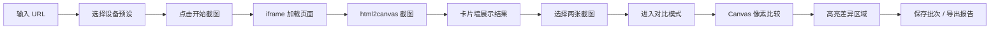

## 1. 产品概述

多分辨率截图对比器是一款面向前端开发者的视觉回归测试工具，解决在多设备、多分辨率下手动检查页面布局错位效率低下的问题。用户输入网址后，工具自动生成多种预设设备尺寸的页面截图并以卡片墙形式并排展示，支持任意两张截图的像素级差异对比，快速发现布局问题。

## 2. 核心功能

### 2.1 功能模块
1. **设备配置面板**：管理预设设备列表，支持增删改设备尺寸，启用/禁用特定设备
2. **截图网格视图**：输入 URL 后批量生成多设备截图，卡片墙形式展示，支持选择截图进入对比
3. **对比视图**：支持两种对比模式（重叠/并排），自动高亮像素差异区域，可调节差异敏感度
4. **数据持久化**：保存当前批次截图到本地存储，支持重新加载历史批次，导出 HTML 格式差异报告

### 2.3 页面详情

| 页面名称 | 模块名称 | 功能描述 |
|---------|---------|---------|
| 主页面 | URL输入栏 | 输入目标网址，代理配置开关，一键截图按钮 |
| 主页面 | 设备配置面板 | 预设设备列表展示、编辑、删除、新增，启用/禁用切换 |
| 主页面 | 截图卡片墙 | 网格布局展示所有设备截图，显示设备名、尺寸、截图缩略图，支持选中标记 |
| 主页面 | 对比工具栏 | 显示已选中截图数量，进入对比模式按钮，清空选择按钮 |
| 对比模态框 | 顶部控制栏 | 模式切换（重叠/并排），差异敏感度滑块，关闭按钮 |
| 对比模态框 | 对比显示区 | 并排模式下左右各显示一张截图，重叠模式下图层叠加，差异区域高亮标记 |
| 对比模态框 | 差异统计 | 显示差异像素数量、差异百分比、差异区域列表 |
| 主页面 | 批次管理 | 保存当前批次，历史批次列表，加载批次，删除批次，导出报告 |

## 3. 核心流程

用户输入目标 URL → 选择要使用的设备预设 → 点击开始截图 → 工具依次在 iframe 中加载页面并使用 html2canvas 截取 → 截图完成后以卡片墙展示 → 用户点击选择两张截图 → 进入对比模式 → Canvas 逐像素比较并高亮差异 → 用户可保存批次或导出差异报告

## 4. 用户界面设计

### 4.1 设计风格
- **主色调**：深青色 `#0d9488`（专业、精准），搭配暗灰背景 `#0f172a`（减少视觉干扰，突出截图内容）
- **辅助色**：差异高亮使用红色半透明叠加 `#ef4444`，选中状态使用亮青色边框 `#2dd4bf`
- **按钮风格**：圆角中等（8px），悬停有轻微上浮和阴影增强，主按钮使用渐变填充
- **字体**：标题使用 JetBrains Mono（等宽、技术感），正文使用 Geist Sans（现代、清晰）
- **布局风格**：深色模式工业风，左侧设备配置边栏，右侧主内容区，截图卡片带细微边框和悬停缩放效果
- **图标风格**：使用 lucide-vue-next 线性图标

### 4.2 页面设计概述

| 页面名称 | 模块名称 | UI 元素 |
|---------|---------|---------|
| 主页面 | URL输入栏 | 深色输入框带发光边框，左侧 URL 图标，右侧主按钮 |
| 主页面 | 设备配置面板 | 可折叠侧栏，设备卡片列表，每个卡片显示设备名、分辨率、开关 |
| 主页面 | 截图卡片墙 | CSS Grid 自适应列数，卡片悬停微放大 + 亮边，选中态青绿色边框 |
| 对比模态框 | 顶部控制栏 | 半透明磨砂背景，模式切换 Tab，滑块控件 |
| 对比模态框 | 对比显示区 | 并排双栏或单图叠加，差异区域红色半透明遮罩，鼠标悬停显示差异坐标 |
| 主页面 | 批次管理 | 顶部胶囊形标签栏，历史批次下拉选择 |

### 4.3 响应式
- 桌面端优先设计，适配 1280px 以上宽度
- 截图卡片墙使用 CSS Grid 自适应列数
- 对比模态框在小屏幕下自动切换为垂直并排布局
