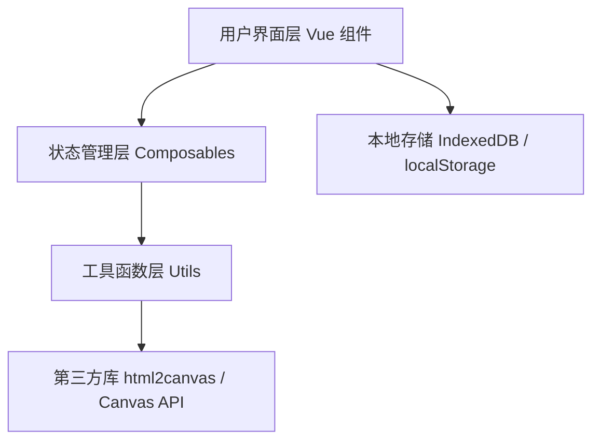
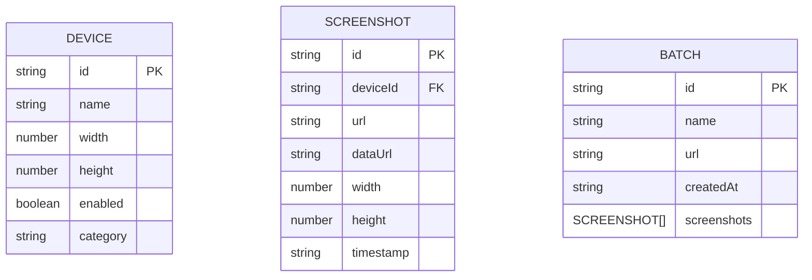

## 1. 架构设计



## 2. 技术说明
- **前端**：Vue 3 + TypeScript + Vite
- **样式**：Tailwind CSS 3
- **截图**：html2canvas（通过 iframe 加载目标页面后截取）
- **像素对比**：原生 Canvas 2D API 逐像素比较
- **数据存储**：localStorage 存储设备配置，IndexedDB 存储截图批次数据（大容量）
- **图标**：lucide-vue-next

## 3. 路由定义

| 路由 | 用途 |
|-----|-----|
| / | 主页面，包含设备配置、截图网格、对比模态框 |

单页应用，无需多路由，所有功能通过组件切换和模态框实现。

## 4. 数据模型

### 4.1 数据模型定义



### 4.2 TypeScript 类型定义

```typescript
interface Device {
  id: string;
  name: string;
  width: number;
  height: number;
  enabled: boolean;
  category: 'mobile' | 'tablet' | 'desktop';
}

interface Screenshot {
  id: string;
  deviceId: string;
  deviceName: string;
  url: string;
  dataUrl: string;
  width: number;
  height: number;
  timestamp: string;
}

interface ScreenshotBatch {
  id: string;
  name: string;
  url: string;
  createdAt: string;
  screenshots: Screenshot[];
}

interface DiffResult {
  diffPixels: number;
  diffPercentage: number;
  diffDataUrl: string;
  diffRegions: DiffRegion[];
}

interface DiffRegion {
  x: number;
  y: number;
  width: number;
  height: number;
}
```

## 5. 项目结构

```
src/
├── components/
│   ├── DeviceConfig.vue       # 设备配置面板
│   ├── ScreenshotGrid.vue     # 截图卡片墙
│   ├── ScreenshotCard.vue     # 单个截图卡片
│   ├── ComparisonView.vue     # 对比视图模态框
│   ├── UrlInputBar.vue        # URL 输入栏
│   └── BatchManager.vue       # 批次管理
├── composables/
│   ├── useDevices.ts          # 设备配置状态管理
│   ├── useScreenshots.ts      # 截图批处理逻辑
│   ├── useCompare.ts          # 像素对比逻辑
│   └── useBatchStorage.ts     # 本地存储管理
├── data/
│   └── devices.json           # 预设设备列表
├── types/
│   └── index.ts               # 全局类型定义
├── utils/
│   ├── capture.ts             # iframe + html2canvas 截图
│   ├── diff.ts                # Canvas 像素比较
│   └── report.ts              # 差异报告生成
├── App.vue
├── main.ts
└── style.css
```
